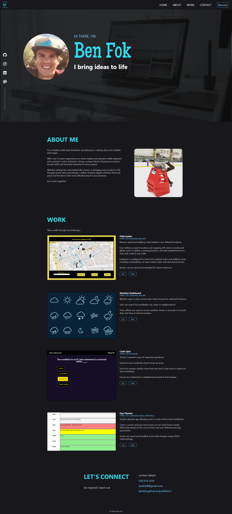

# portfolio1

## Personal Portfolio Website
Every developer needs a place to showcase their work and host their contact information. I wanted to create a page using just HTML and CSS as a baseline for further development and to add my future projects. It was important to me that the page be clean, simple and responsive. 

## Links
The deployed website can be found [here](https://benfok.github.io/portfolio1/)

The repository in GitHub is [here](https://github.com/benfok/portfolio1)

## Screenshot
Here is a screenshot of my finished page. Some key details and learnings are below.

## Details and Learnings
- Coding mobile-first was important for the scalability and resposiveness of the elements. This took some getting used to.
- Without Javascript to code a mobile nav, I had to be creative with moving the Resume item button when the screen narrowed
- display: flex was key in aligning elements responsively
- The sidebar was fun to create, and then to move to the bottom of the page in a narrow view by changing the flex-direction
- I enjoyed playing with hover effects to add some micro itneractions to the site. I realized the challenge of having these be relevant on smaller screens (touch screen) and so replaced some of the hover elements with permenant styles in this case
- I used variables for the colors so I could code a 'light theme' for future toggling. Would also require switching out some icons
- I used placeholder images and imaginary content for my work examples
- Using viewport width for sizes of fonts and padding/margin in some areas was an interesting way to scale content responsively
- Final sweep through code included ensure use of semantic HTML, indentation, quality comments and removal of redundant CSS

